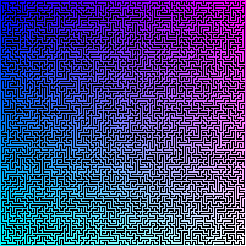

# maze

A maze generator implemented in SysY.

## Usage

```sh
echo $RANDOM 4 | ./maze > maze.ppm
```

The first parameter (`$RANDOM`) is random seed, the second parameter is the zoom level of the generated maze image.

The generated maze looks like:


